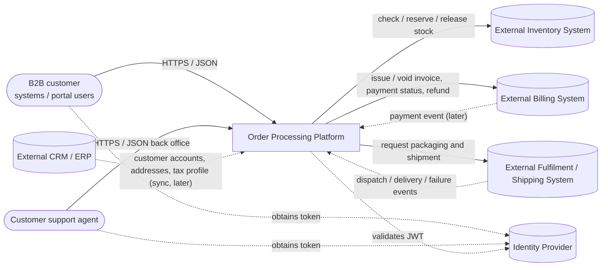
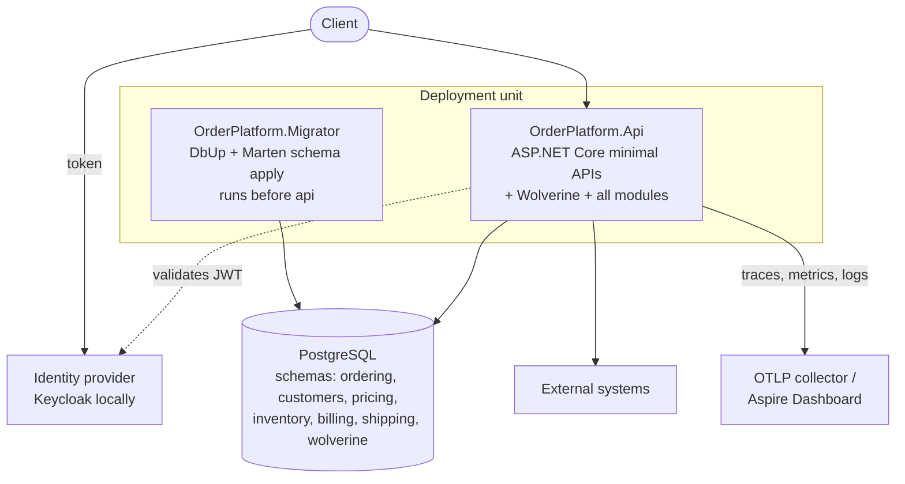
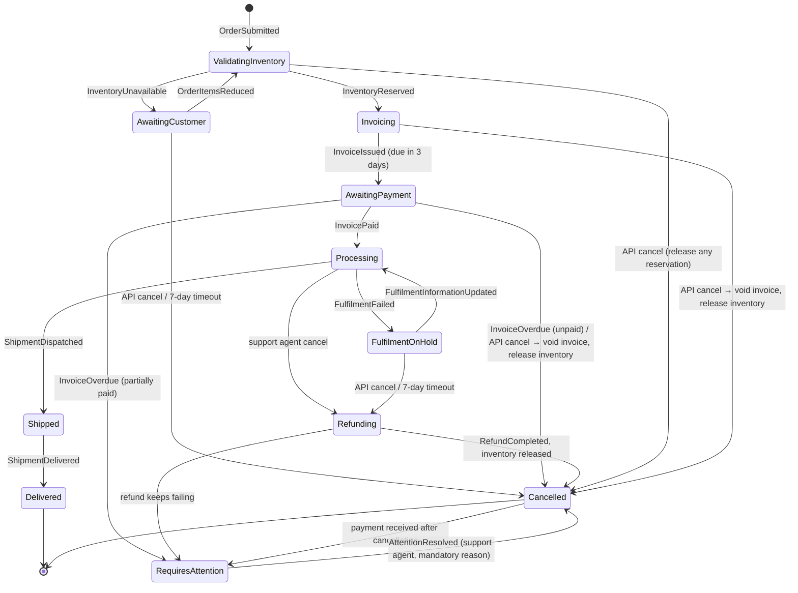

# Order Processing Platform — Architecture

This folder is the entry point for the delivery team. It describes **what** we are building, **how** it is structured,
and **why** each significant decision was made.

| Document | Purpose |
|---|---|
| [implementation-plan.md](implementation-plan.md) | Phased plan, milestones, acceptance criteria, risks and open questions |
| [adr/](adr/README.md) | Architecture Decision Records — one decision per file, immutable once accepted |
| [phase-0-results.md](phase-0-results.md) | Evidence from the verification spikes and the design changes they caused |
| [ai-usage.md](ai-usage.md) | How AI was used while producing these artifacts and where human judgement overrode it |

## 1. Scope

The platform supports:

- Creating an order with one or more products
- Retrieving an order
- Cancelling an order when permitted
- Tracking the order lifecycle
- Validating inventory availability before accepting an order
- Calculating pricing (taxes and additional charges)
- Integrating with external inventory, payment and shipping systems

This repository delivers an **implementation-ready skeleton**, not a complete product: the structure, contracts,
cross-cutting foundations and one fully worked vertical slice (Submit / Get / Cancel Order) that the team copies.

**What is built.** Phases 0 to 4 of the [implementation plan](implementation-plan.md) are delivered. An order can be
submitted, priced against seeded price lists, reserved in the external inventory system through the outbox, read with
its history and cancelled with its compensation — all against the schema the Migrator builds, proven by the tests in
each PR. The complete order state machine of [ADR-0017](adr/0017-order-lifecycle-process.md) is implemented and
covered by domain tests, including the states no endpoint reaches yet.

**What is not.** Invoicing, payment checks, timers, fulfilment and the retry/dead-letter policy are specified but not
built: they are the ordered [next steps](implementation-plan.md#next-steps-for-the-delivery-team) N1 to N16. Billing and
shipping have ports with fakes, and billing additionally has a real-shaped HTTP adapter; the other adapters are next
steps. One design question is open and should be decided before N3 — see
[ADR-0017 §2a](adr/0017-order-lifecycle-process.md).

## 2. Domain scope: a B2B ordering platform

"Order processing" means very different things for an airline, a retail web shop or a B2B supplier. **This platform is
designed for B2B ordering.** This is the fundamental assumption behind the order lifecycle, payment model and
cancellation rules. Changing it invalidates [ADR-0017](adr/0017-order-lifecycle-process.md) and parts of this document.

### Business assumptions

| Area | Assumption |
|---|---|
| Customers | Businesses with a customer account; several users per account. Users can only see and act on their own account's orders. Orders are submitted via the API — by customer systems (client credentials) or portal users. |
| Customer data | The external CRM/ERP is the system of record for customer accounts (VAT number, tax profile, billing and shipping addresses, contacts). The platform keeps a local read copy; v1 seeds it, synchronisation is backlog. |
| Products | Product ids are SKUs of the external inventory system. A SKU without a price in the customer's price list is unknown and rejected at submission. |
| Speed | Customers do not need an instant answer. Validation, reservation and invoicing happen asynchronously; the order status tells the customer where the order is. |
| Inventory | The external inventory system is the source of truth. "Gather goods" is a system step: check availability, then reserve **all** items (all-or-nothing). If this fails, we contact the customer. |
| Customer contact | When an order needs a customer decision, it waits for the customer. Without a response within **7 days** (configurable) it is cancelled automatically. |
| Order edits | While waiting for the customer after an inventory problem, the customer may **remove items or reduce quantities** only. The order is then validated again. |
| Pricing | Base price list plus customer-specific prices. Prices, taxes (including B2B rules such as VAT reverse charge) and additional charges are calculated at submission and again after every edit; the price is locked at that point. The invoice uses the latest calculated breakdown. Single currency: **EUR**. |
| Payment | **Payment by invoice**, issued by an external billing system. No card payments on the platform. Payment is due within **3 calendar days** (UTC) of issuing. |
| Payment status | Pulled from the external billing system **once a day**, on demand via a manual refresh, and later pushed by an event (webhook) from the billing system. |
| Unpaid invoice | At the due date, an unpaid invoice cancels the order and releases the inventory. A **partial** payment counts as not paid; if still partial at the due date, the order goes to customer support instead of being cancelled. |
| Late payment | Payment received for an already cancelled order is not handled automatically: the order is flagged for customer support. |
| Fulfilment | After payment, packaging and shipment are performed by an external fulfilment/shipping system. "Processing" covers packaging and shipping preparation. |
| Fulfilment problems | Any error during processing puts the order on hold and the customer is contacted: they either **update the information** (processing resumes) or **cancel** (refund issued, inventory released). |
| Cancellation | Via the API: allowed while inventory is validated, while waiting for the customer, during invoicing and while awaiting payment, and when offered during a fulfilment hold. From processing onwards, the API does not allow cancellation: a **customer support agent** cancels on the customer's behalf (up to and including processing). |
| Out of scope | Returns after shipment, partial shipments, multi-currency, adding items to an existing order, credit limits, payment terms other than 3 days, CRM/ERP synchronisation and price list maintenance (seeded in v1), the customer portal itself. |

## 3. Architectural style at a glance

- **Modular monolith** — one deployable, strong module boundaries, each module extractable later ([ADR-0002](adr/0002-modular-monolith.md)).
- **Wolverine** for in-process messaging with a **durable Postgres outbox** and durable scheduled messages ([ADR-0004](adr/0004-wolverine-for-messaging.md), [ADR-0005](adr/0005-durable-in-process-messaging.md)).
- **Marten event sourcing** for the Ordering module; the Order aggregate drives its own lifecycle ([ADR-0006](adr/0006-marten-event-sourcing-for-ordering.md), [ADR-0017](adr/0017-order-lifecycle-process.md)).
- **Dapper + DbUp** for relational modules, no EF Core ([ADR-0007](adr/0007-dapper-and-dbup-for-relational-data.md)).
- **Forward-only, backward-compatible database changes (expand/contract)** so any release can be rolled back by redeploying the previous version ([ADR-0009](adr/0009-expand-contract-database-changes.md)).
- **Feature flags** separate deployment from release — v1 on Microsoft.FeatureManagement behind our own interface, OpenFeature as the planned target ([ADR-0019](adr/0019-feature-flags.md)).
- **Minimal APIs** that translate HTTP into messages ([ADR-0011](adr/0011-minimal-apis-dispatch-messages.md)).
- **Versioned, additive-only HTTP API** with problem details and idempotency keys ([ADR-0020](adr/0020-api-conventions-and-versioning.md)).
- **OpenTelemetry, Aspire, Keycloak and docker-compose from day one** ([ADR-0012](adr/0012-observability-opentelemetry-day-one.md), [ADR-0013](adr/0013-local-development-aspire-and-compose.md), [ADR-0016](adr/0016-security-baseline.md)).
- **Build once, migrate, roll out, roll back automatically** ([ADR-0021](adr/0021-deployment-and-ci-cd.md)), with a test level for every architectural promise ([ADR-0022](adr/0022-testing-strategy.md)).

## 4. System context (C4 level 1)



## 5. Containers (C4 level 2)



## 6. Modules

| Module | Responsibility | Persistence | Talks to |
|---|---|---|---|
| **Ordering** | Order aggregate and lifecycle process, submit / get / edit / cancel, customer contact and support actions, idempotency records | Marten (event sourced), schema `ordering` | Customers, Pricing, Inventory, Billing, Shipping via Contracts / messages |
| **Customers** | Customer accounts reference data: status, tax profile, billing/shipping addresses (incl. immutable snapshots), contacts. **Sole owner of personal data**; erasure/anonymisation | Dapper + DbUp, schema `customers` (local read copy) | External CRM/ERP (sync later) |
| **Pricing** | Price lists (base + customer-specific), line totals, tax, additional charges as a rule pipeline | Dapper + DbUp, schema `pricing` (price lists, tax rules, charge rules) | Customers (tax profile) |
| **Inventory** | Availability checks, reservation and release; anti-corruption layer over the external inventory system | Dapper + DbUp, schema `inventory` (reservation records, idempotency) | External inventory |
| **Billing** | Issue and void invoices, payment status checks, refunds; ACL over the external billing system | Dapper + DbUp, schema `billing` (invoice records, refund attempts, idempotency) | External billing |
| **Shipping** | Packaging/shipment requests, dispatch and delivery tracking, failure reporting; ACL over the fulfilment system | Dapper + DbUp, schema `shipping` | External fulfilment / shipping |

Each module is split into `Domain`, `Application`, `Infrastructure` and `Contracts` projects. **Only `Contracts` may be
referenced by other modules** — enforced by architecture tests ([ADR-0015](adr/0015-architecture-tests-enforce-boundaries.md)).

## 7. Target solution structure

```
OrderPlatform.slnx
global.json                                            pinned .NET SDK
Directory.Build.props / Directory.Packages.props      central build settings and package versions
src/
  AppHost/
    OrderPlatform.AppHost                              Aspire orchestration (dev inner loop)
    OrderPlatform.ServiceDefaults                      OpenTelemetry, health checks, HTTP resilience
  Host/
    OrderPlatform.Composition                          module list + Marten/Wolverine configuration, shared by Api and Migrator
    OrderPlatform.Api                                  HTTP host: endpoints, auth, API conventions
  Tools/
    OrderPlatform.Migrator                             DbUp scripts, Marten schema, Wolverine storage, verification (ADR-0008)
  BuildingBlocks/
    OrderPlatform.BuildingBlocks                       technology-free primitives: Result, Error, Money, AccountAccess, IFeatureFlags + flag registry (usable by Domain/Contracts/Application)
    OrderPlatform.BuildingBlocks.Infrastructure        IModule, RelationalOutbox, problem details, idempotency filter, JSON converters,
                                                       claims/policy names, integration mode guard (Marten/Wolverine/ASP.NET Core dependent)
  Modules/
    Ordering/   Ordering.Domain | Ordering.Application | Ordering.Infrastructure | Ordering.Contracts
    Customers/  ...
    Pricing/    Pricing.Domain  | Pricing.Application  | Pricing.Infrastructure  | Pricing.Contracts
    Inventory/  ...
    Billing/    ...
    Shipping/   ...
tests/                                                 levels and tooling per ADR-0022
  <Module>.Domain.Tests                               aggregates, state machine, pricing rules
  <Module>.Application.Tests                          handlers with in-memory fakes
  <Module>.Infrastructure.Tests                       HTTP adapters against WireMock.Net
  OrderPlatform.Api.IntegrationTests                  Testcontainers Postgres, end-to-end slices
  OrderPlatform.Architecture.Tests                    module boundary rules (ArchUnitNET)
  OrderPlatform.Migrations.Tests                      expand/contract rule enforcement
  OrderPlatform.AppHost.Tests                         Aspire AppHost starts the system, Migrator first
  OrderPlatform.Testing                               shared test infrastructure (containers, processes, tokens, WireMock, flags)
deploy/
  docker-compose.yml, .env.example
  keycloak/orderplatform-realm.json                   local identity realm (dev-only credentials)
.github/workflows/, .github/scripts/                   CI/CD reference pipeline, release compatibility and compose smoke test (ADR-0021)
architecture/
  this folder
```

## 8. Order lifecycle



Rules live in the Order aggregate, not in endpoints. Details, API surface, timers and failure handling are in
[ADR-0017](adr/0017-order-lifecycle-process.md).

> **Open issue.** Closing an order as cancelled is the *only* way out of `RequiresAttention` in v1, and support settles
> the money outside the system. ADR-0017 §6 also mentions reinstatement, which has no target state and needs a business
> decision before the invoicing next steps — see [ADR-0017 §2a](adr/0017-order-lifecycle-process.md).

## 9. How the non-functional requirements are addressed

| Concern | Approach | ADRs |
|---|---|---|
| Modularity | Module-per-bounded-context, Contracts-only references, schema per module | 0002, 0003, 0015 |
| Maintainability | Consistent module template, vertical slices, ADRs, central package management, versioned API contract | 0001, 0003, 0020 |
| Testability | Pure domain projects, ports for all externals, a defined test level for every architectural promise | 0014, 0015, 0022 |
| Scalability | Stateless API, horizontal scale; Wolverine durability agents coordinate across nodes; modules extractable | 0002, 0005 |
| Reliability | Transactional outbox, durable queues and scheduled messages, single-owner retries + dead letters, compensation, idempotency keys (API and external calls), resilience policies | 0005, 0014, 0017, 0020 |
| Security | OIDC (client credentials for systems), account-scoped authorization, support-agent policy, per-account rate limiting, personal data isolated in Customers, no DDL rights for the API | 0016, 0017 |
| Observability | OpenTelemetry traces/metrics/logs from day one, correlation across messages | 0012 |
| Deployment | Build-once images, migrator job, rolling updates with automatic rollback, expand/contract for zero downtime, feature flags to separate deploy from release | 0008, 0009, 0013, 0019, 0021 |
| Extensibility | Pricing rule pipeline, adapters behind ports, event-sourced history enables new projections, flagged rollout of new behaviour | 0006, 0014, 0018, 0019 |
